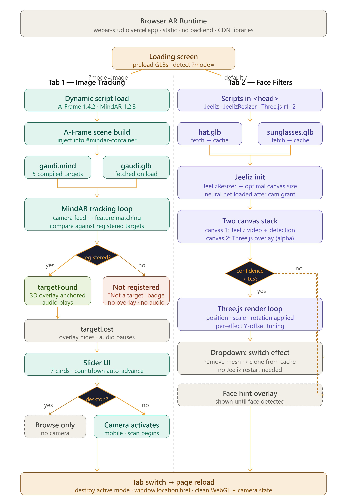

# Browser AR Runtime

A browser-native augmented reality engine with two modes in one repo — real-time face filters powered by Jeeliz + Three.js, and image tracking powered by MindAR + A-Frame. No frameworks, no backend, no install.

**Live Demo:** https://webar-studio.vercel.app

---

## Why This Exists

Cultural institution apps need AR that works without an app store. A visitor points their phone at an exhibit image and a 3D overlay appears — no QR code, no download, no WebXR device requirement. The same runtime also powers face filter experiences in the browser. This repo isolates both modes in standalone, runnable form, distilled from a production system serving 30+ cultural institution apps across Spain, France, and Belgium.

---

## Architecture



---

## Two Modes, One Repo

### Tab 1 — Image Tracking (MindAR + A-Frame)

Point your camera at a registered target image — a 3D overlay appears anchored to that image in world space.

- 7 target cards in a slider — 5 are registered trackable targets, 2 are intentional non-targets
- For each trackable target: Gaudí bust 3D model overlaid + narration audio plays on `targetFound`, pauses on `targetLost`
- Non-targets show a **"Not a registered target"** badge — no overlay, no audio
- A countdown timer auto-advances through the slider; user can also swipe manually
- Desktop: no camera request — image tracking only makes sense on mobile, so the desktop view shows the target cards in browse mode only
- Mobile: camera activates automatically on tab load

### Tab 2 — Face Filters (Jeeliz + Three.js)

Real-time face detection and 3D model overlay via webcam. No server involved — everything runs on the GPU in the browser.

- Jeeliz FaceFilter detects face position, scale, and head rotation every frame
- Three.js renders a GLB model anchored to the detected face on a transparent overlay canvas
- Two effects selectable via dropdown: **Black Leather Hat** and **Sunglasses**
- Both GLBs are fetched and cached in memory on page load — effect switching is instant, no re-download
- Per-effect Y-offset and scale tuning so hat sits on the head and sunglasses align to the eyes
- "Point your camera at your face" hint shown until face is detected, hidden once tracking begins

**The 7 targets:**

| # | Image | Status |
|---|---|---|
| 1 | Antoni Gaudí — young portrait (colorized) | ✅ Trackable |
| 2 | Unknown man in suit | ❌ Not registered |
| 3 | Antoni Gaudí — framed poster, 1852–1926 | ✅ Trackable |
| 4 | Young man, studio photo | ❌ Not registered |
| 5 | Sagrada Família tower — mosaic spire detail | ✅ Trackable |
| 6 | Gaudí statue with Sagrada Família and lizard mosaic | ✅ Trackable |
| 7 | Casa Batlló facade | ✅ Trackable |

The two non-targets are deliberate. They demonstrate that the system performs **image-feature matching against a registered set**, not category recognition. A similar-looking portrait won't trigger the overlay — only the exact registered images do.

---

## Stack

| Layer | Tech |
|---|---|
| Face detection | Jeeliz FaceFilter (WebGL neural net) |
| 3D rendering — Face AR | Three.js r112 + GLTFLoader |
| Image tracking | MindAR 1.2.3 |
| AR scene — Image AR | A-Frame 1.4.2 |
| 3D models | GLB (fetched on load, cached in memory) |
| Audio | HTML5 Audio API |
| Deploy | Vercel (static, no build step) |
| Libraries | CDN only — nothing installed |

---

## Quick Start

No install required. Clone and open.

```bash
git clone https://github.com/sujoymondal87/browser-ar-runtime.git
cd browser-ar-runtime
npx serve .
```

Visit `http://localhost:3000` in a browser with camera access.

For image tracking, use a mobile device or grant camera permission on desktop. Point the camera at any of the 5 registered target images shown in the slider.

---

## How Tab Switching Works

Switching tabs triggers a page reload with a /face`:

```
                    → Image AR (default)
/face               → Face AR
```

This is intentional. Jeeliz and MindAR both claim the WebGL context and the camera stream. Destroying and reinitialising them in the same page lifetime causes context conflicts and camera lock errors across browsers. A page reload is the cleanest solution — the loading screen makes it invisible to the user.

---

## Architecture Decisions

**Why Jeeliz instead of MediaPipe or TensorFlow.js for face tracking?**
Jeeliz FaceFilter is a single self-contained WebGL neural net with no dependency graph. It runs entirely on the GPU, requires no WASM, and has a stable API. At the scale of this demo — single face, position and rotation only — it outperforms heavier frameworks on mid-range mobile hardware.

**Why Two separate canvas elements for Face AR?**
Jeeliz owns one canvas for the video feed and neural net computation. Three.js owns a second canvas with `alpha: true` stacked on top via CSS. Sharing the WebGL context between Jeeliz and newer Three.js versions causes rendering bugs. Two canvases eliminates the conflict entirely.

**Why GLBs fetched on load rather than bundled?**
The models are large binary assets. Fetching them once and holding them in memory means effect switching is instantaneous — no re-download, no re-parse. The browser cache handles persistence across sessions.

**Why page reload on tab switch instead of in-page teardown?**
Jeeliz and MindAR both acquire the camera stream at the OS level. Neither library fully releases it on destroy across all browsers — Chrome on Android is particularly unreliable. A page reload guarantees a clean state. The shared loading screen makes the transition seamless.

**Why desktop shows browse-only mode for Image AR?**
Image tracking requires a physical camera pointed at a physical image. On desktop, that interaction model doesn't exist. Requesting camera permission on desktop produces a confusing UX and serves no demo purpose. Desktop users can still browse the target set and understand what the mobile experience does.

**Why two non-targets in the slider?**
To demonstrate the architecture honestly. The system uses compiled image feature descriptors — it matches against a specific registered set, not a category. Including similar-looking images that deliberately fail to trigger AR shows exactly where the boundary is.

---

## Trade-offs

| Decision | Upside | Limitation |
|---|---|---|
| CDN-only libraries | Zero install, instant fork | CDN downtime breaks the demo |
| Page reload on tab switch | Clean camera + context state | Brief loading screen on every switch |
| Single `.mind` file for all targets | One compile, one load | Recompile needed to add or remove targets |
| Same GLB for all trackable targets | Simple asset pipeline | No per-target differentiation in the overlay |
| Desktop browse-only for Image AR | Honest UX, no wasted permission prompt | Feature appears disabled on desktop |
| Two canvas elements | No WebGL context conflict | Extra DOM element, slightly more CSS to manage |

---

## Deployment

Static site — no build step.

**Vercel:**
1. Connect repo, framework preset: **Other**
2. Build command: leave empty
3. Output directory: leave empty
4. No environment variables

The `vercel.json` sets `Cross-Origin-Opener-Policy` and `Cross-Origin-Embedder-Policy` headers — required for MindAR's use of `SharedArrayBuffer`.

---

## Production Context

The AR system this repo is distilled from is deployed inside a no-code app platform serving cultural institutions across Spain, France, and Belgium. The production face filter runtime handles GLTF model loading, expression-triggered animations, and multi-language narration routing. The image tracking runtime powers museum exhibit overlays — visitors point their phone at a physical exhibit image and a 3D model appears anchored to it in world space. This repo isolates both modes in standalone, runnable form with the same core architecture.

---

## Asset Attribution

| Asset | Author | License |
|---|---|---|
| Black Leather Hat GLB | iGauravRajput | CC BY 4.0, Sketchfab |
| Sunglasses GLB | Eric Chadwick / Darmstadt Graphics Group GmbH | CC BY 4.0, Khronos glTF Sample Assets |
| Antoni Gaudí bust GLB | Roberto Domínguez (@vmmaniac) | CC BY 4.0, Sketchfab |

---

## Lessons Learned

- `targetFound` and `targetLost` event listeners in MindAR must use explicit `(e) =>` arrow functions — referencing the global `event` object inside the handler silently fails in Safari
- MindAR requires `Cross-Origin-Opener-Policy: same-origin` + `Cross-Origin-Embedder-Policy: require-corp` — missing either header produces a `SharedArrayBuffer is not defined` error with no useful stack trace
- Jeeliz and Three.js r112 share the WebGL context without conflict; r125+ breaks — pin the Three.js version
- Camera stream on Android Chrome is not reliably released by `JEELIZFACEFILTER.destroy()` — always reload the page rather than attempting in-page teardown

---

## Interesting Discussion Topics

- MindAR compiles target images into `.mind` files at author time. How would you build a runtime that compiles targets on the fly from user-uploaded images without blocking the main thread?
- The two non-targets in this demo fail silently — the user sees no overlay. What feedback mechanism would you add to make the "not registered" state explicit in a real museum deployment?
- The page-reload tab switch is a pragmatic solution to a real browser bug. At what point would you invest in a proper in-page teardown and what would that look like?
- Face AR and Image AR share a loading screen but nothing else. What would a unified AR session manager look like if both modes needed to run simultaneously?
